# Website Deployment on AWS using Custom VPC and Monitoring

##  Project Overview
This project demonstrates hosting a scalable and highly available website on **AWS** by creating a **Custom VPC** with **Auto Scaling**, **Application Load Balancer**, and monitoring via **CloudWatch**. It also integrates **Simple Notification Service (SNS)** for real-time alerts and notifications, ensuring continuous availability, scalability, and operational visibility.

🔗 **GitHub Repository:** [Website_Deployment_on_AWS](https://github.com/jayshrilandge30/Website_Deployment_on_AWS)

---

##  Features
- **Custom VPC** for secure and isolated networking
- **Auto Scaling** for handling varying traffic loads
- **Application Load Balancer** for distributing requests
- **CloudWatch Monitoring** with alarms and dashboards
- **AWS SNS** for instant notifications
- **Secure Database Deployment** in private subnet

---

## 🛠 Project Implementation Steps

### 1️⃣ Create a Custom VPC
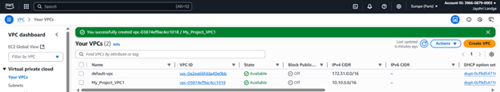

### 2️⃣ Create Subnets (Public & Private)

### 3️⃣ Create an Internet Gateway
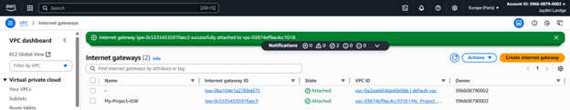

### 4️⃣ Create a NAT Gateway
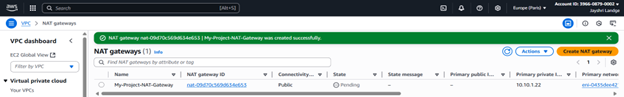

### 5️⃣ Create Route Tables (Public & Private)
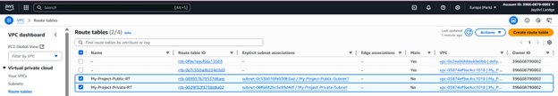

### 6️⃣ Create Security Group (Ports 22, 80)
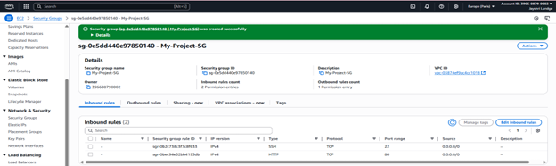

### 7️⃣ Create an SNS Topic
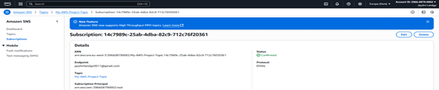

### 8️⃣ Create an Empty Target Group
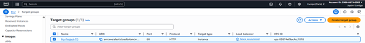

### 9️⃣ Create an Application Load Balancer
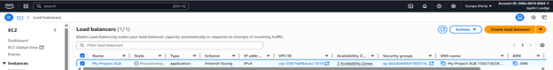

### 🔟 Create Launch Template
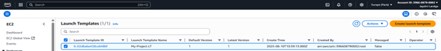

### 1️⃣1️⃣ Create an Auto Scaling Group
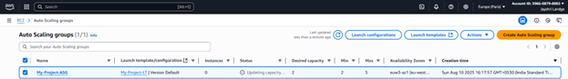

### 1️⃣2️⃣ Create CloudWatch Alarms
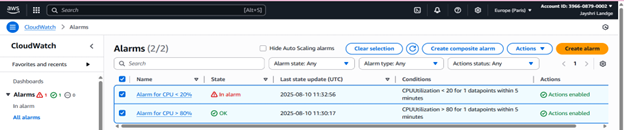

### 1️⃣3️⃣ Create CloudWatch Dashboard
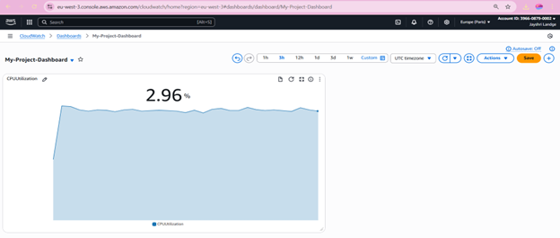

### 1️⃣4️⃣ Attach Domain to Load Balancer
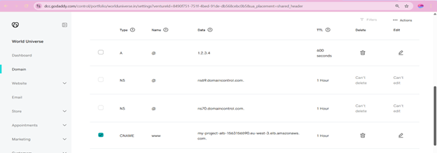

### 1️⃣5️⃣ Launch Database in Private Subnet
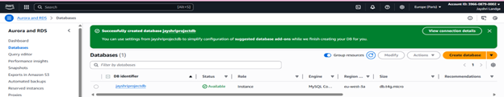

---

##  Website Outputs

### Server & Database
- **Deployed Server Instances**  
  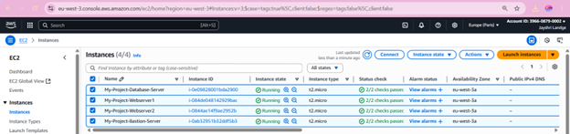
- **Database Table in Private Subnet**  
  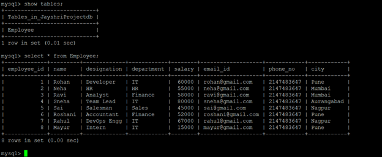
- **SNS Notification Received in Gmail**  
  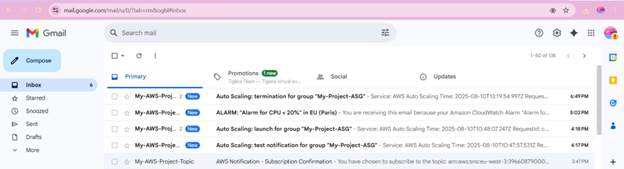

### Public IP Outputs
- **Webserver 1 Output**  
  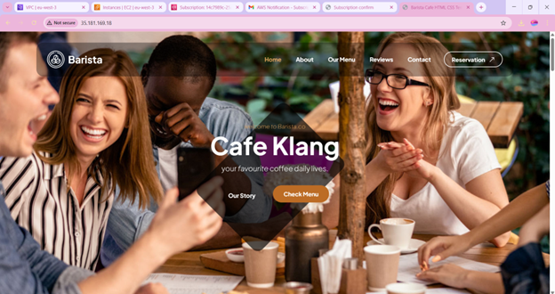
- **Webserver 2 Output**  
  

### Load Balancer & Domain Outputs
- **Application Output via Load Balancer DNS**  
  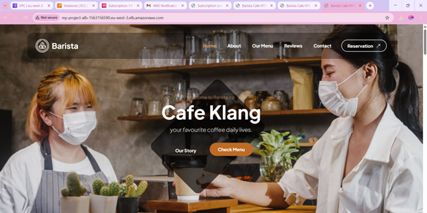
- **Final Deployed Website Home Page with Domain**  
  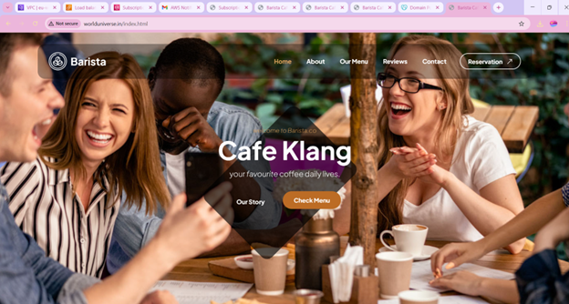
- **About Page via Domain**  
  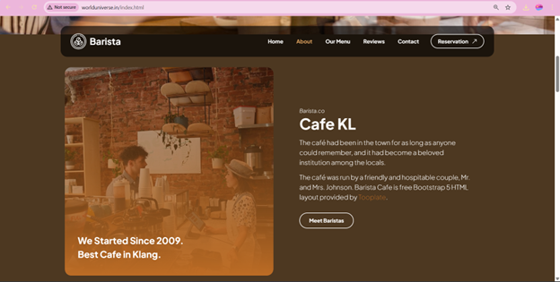
- **Our Menu Section**  
  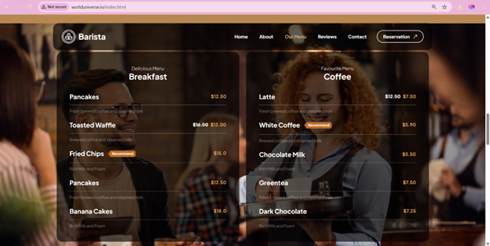
- **Customer Reviews Section**  
  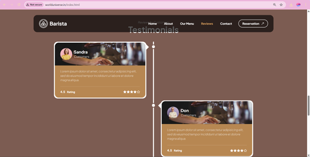
- **Contact Page**  
  

---

##  Project Architecture
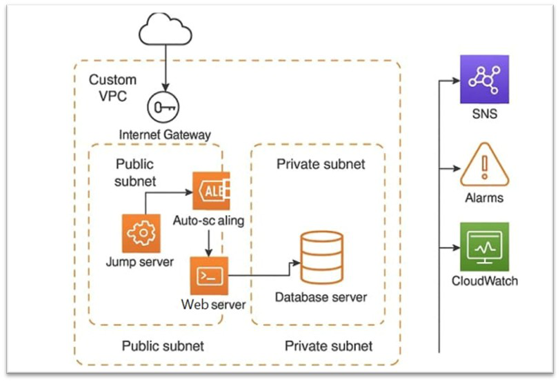

---

##  Summary
- Hosted a **scalable & highly available website** on AWS using a **Custom VPC**  
- Implemented **Auto Scaling** and **Application Load Balancer** for traffic management  
- Enabled **CloudWatch Monitoring** with alarms and dashboards  
- Integrated **SNS Notifications** for real-time alerts  
- Secured the architecture by placing the **database in a private subnet**  

---

##   Author
**Jayshri Landge**  
📍 Aurangabad, India  
🔗 [GitHub Profile](https://github.com/jayshrilandge30)
